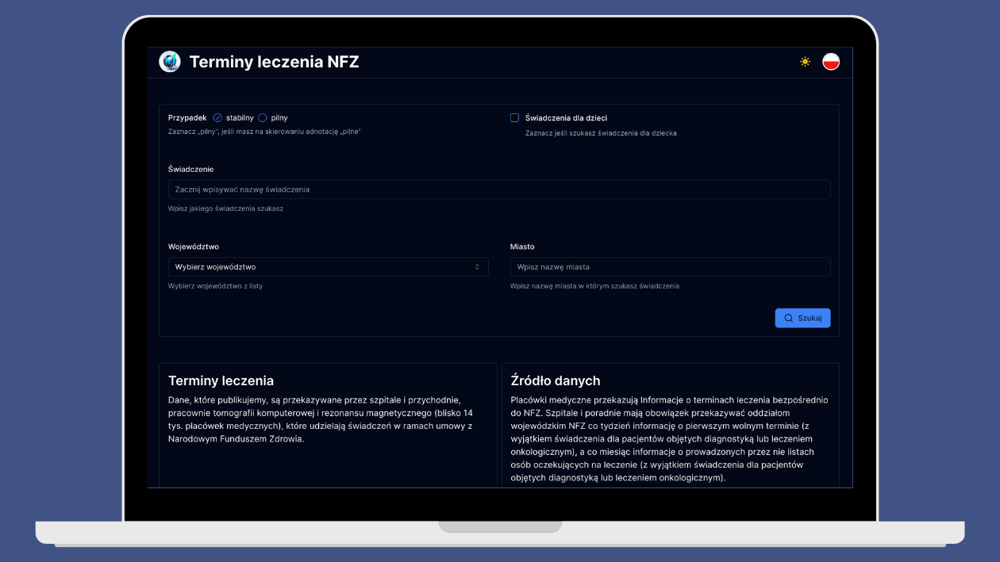

# General info

This website helps you find the nearest available treatment appointments under NFZ, allowing for quick and convenient access to available visits.
<br />

## What's inside?

✔ Next.js 14 (App router)<br />
✔ React 18<br />
✔ TypeScript<br />
✔ JavaScript<br />
✔ Rest API<br />
✔ React Query<br />
✔ React Testing Library<br />
✔ Tailwind<br />
✔ shadcn/ui<br />

## Link to website

To watch click [here]

[here]: https://terminy-leczenia-nfz.vercel.app

## Getting Started

First, run the development server:

```bash
npm run dev
```

Open [http://localhost:3000](http://localhost:3000) with your browser to see the result.
